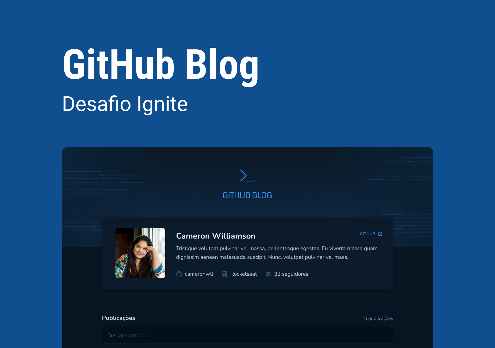

<h1 align="center">
    
</h1>

<p align="center">
  

  

  
  
  <a href="https://github.com/pabloxt14/Github-Blog/commits/master">
    
  </a>
    
   

   <a href="https://github.com/pabloxt14/Github-Blog/stargazers">
    
  </a>
</p>

<p>
  
</p>

<h4 align="center"> 🚀 Aplicação Finalizada 🚀</h4>

<p align="center">
 <a href="#-about">About</a> |
 <a href="#-layout">Layout</a> | 
 <a href="#-deploy">Deploy</a> | 
 <a href="#-how-it-works">How It Works</a> | 
 <a href="#-technologies">Technologies</a> | 
 <a href="#-author">Author</a> | 
 <a href="#-license">License</a>
</p>


## 💻 About

O Github Blog é uma aplicação web que tem como objetivo mostrar visualmente com um design e layout mais bem elaborado os dados do criador deste aplicação, além das `issues` presentes neste mesmo repositório no Github, permitindo também a pesquisa por `issues` específicas.

O principal conceito treinado nesta aplicação foi a utilização de API em projetos React, no caso, a API do Github.

O projeto foi desenvolvido como conclusão de um desafio do curso **Ignite** oferecida pela [Rocketseat](https://www.rocketseat.com.br/). O Ignite é um curso de especialização em stacks específicas amplamente utilizadas e valorizadas no mercado como React, React Native, Node.js e Elixir.

---

## 🎨 Layout

Você pode visualizar o layout do projeto através [desse link](https://www.figma.com/community/file/1138814951106121051). É necessário ter conta no [Figma](https://www.figma.com/) para acessá-lo.

### Web

<p align="center">
  
</p>

---

## 🔗 Deploy

Para acessar o deploy do Website da aplicação basta clicar no link a seguir: [Link](https://github-blog-nu.vercel.app/)

---

## 🚀 How it works

Este projeto contem somente a parte Frontend Web, precisando somente executar a aplicação em seu Browser(navegador).

### Pré-requisitos

Antes de baixar o projeto você vai precisar ter instalado na sua máquina as seguintes ferramentas:

* [Git](https://git-scm.com)
* [NodeJS](https://nodejs.org/en/)
* [Yarn](https://yarnpkg.com/) ou [NPM](https://www.npmjs.com/)

Além disto é bom ter um editor para trabalhar com o código como [VSCode](https://code.visualstudio.com/)

#### 🧭 Rodando a aplicação web (Frontend)

```bash
# Clone este repositório
$ git clone git@github.com:pabloxt14/Github-Blog.git

# Vá para a pasta da aplicação Front End
$ cd Github-Blog

# Instale as dependências
$ npm install

# Execute a aplicação em modo de desenvolvimento
$ npm run dev

# A aplicação será aberta na porta:3000 - acesse http://localhost:3000
```

---

## 🛠 Technologies

As seguintes ferramentas foram usadas na construção do projeto:

#### **Website**  ([Vite](https://vitejs.dev/guide/)  +  [TypeScript](https://www.typescriptlang.org/))

-   **[Styled-Components](https://tailwindcss.com/)**
-   **[React Roter Dom](https://reactrouter.com/en/v6.3.0)**
-   **[Axios](https://github.com/axios/axios)**
-   **[React Hook Form](https://github.com/axios/axios)**
-   **[Zod](https://github.com/colinhacks/zod)**
-   **[@hookform/resolvers](https://www.npmjs.com/package/@hookform/resolvers)**
-   **[date-fns](https://date-fns.org/)**
-   **[Font Awesome](https://fontawesome.com/docs/web/use-with/react/use-with)**
-   **[React Markdown](https://fontawesome.com/docs/web/use-with/react/use-with)**
-   **[React Syntax Highlighter](https://github.com/react-syntax-highlighter/react-syntax-highlighter)**
-   **[@formkit/auto-animate](https://auto-animate.formkit.com/)**

> Veja o arquivo  [package.json](https://github.com/pabloxt14/Github-Blog/package.json)

---

<!-- ## 💪 Como contribuir para o projeto

1. Faça um **fork** do projeto.
2. Crie uma nova branch com as suas alterações: `git checkout -b my-feature`
3. Salve as alterações e crie uma mensagem de commit contando o que você fez: `git commit -m "feature: My new feature"`
4. Envie as suas alterações: `git push origin my-feature`
> Caso tenha alguma dúvida confira este [guia de como contribuir no GitHub](./CONTRIBUTING.md)

--- -->

## ✍ Author


[](https://www.linkedin.com/in/pabloalan/)

[](mailto:pabloxt14@gmail.com)

---

## 📝 License

Este projeto esta sobe a licença [MIT](./LICENSE).

Feito com 💜 por Pablo Alan 👋🏽 [Entre em contato!](https://www.linkedin.com/in/pabloalan/)
